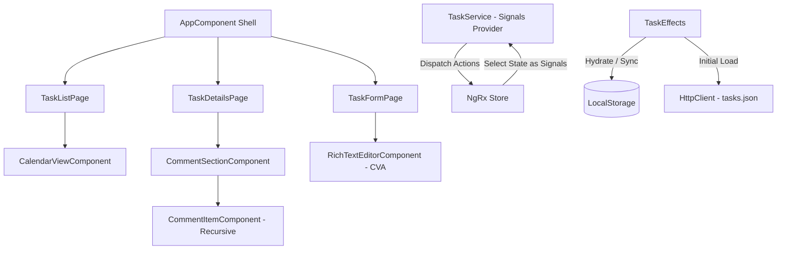

# Premium Task Management Dashboard

A highly performant, state-of-the-art **Task Management Module** built using **Angular 21**, **NgRx Store**, and **Angular Signals**.

The application features a modern responsive UI supporting smooth transitions, a custom WYSIWYG rich text editor, recursive comment threads, and a custom monthly calendar scheduler.

URL: https://taskapp-641a8.web.app/

---

## 🚀 Features & Architecture



### 1. Unified State & Signals Bridge (`TaskService`)
We implemented a hybrid state approach linking the robust reliability of **NgRx Store** with the lightning-fast reactivity of **Angular Signals**:
- **Store**: Standard Actions, Reducer map, and Side Effects serialize state dynamically to `localStorage`.
- **Signals**: Instead of exposing RxJS observables directly in components, the `TaskService` converts selectors to read-only Angular Signals using `store.selectSignal(selector)`. This enables optimal Angular zoneless performance and clean template syntax (`service.tasks()`).

### 2. Custom Rich Text Editor (`ControlValueAccessor`)
Rather than relying on bloated external WYSIWYG editor packages which frequently break during peer dependency resolution on new Angular releases (like v21), we built a native **Rich Text Editor Component** implementing `NG_VALUE_ACCESSOR`. It supports:
- Rich format toggles: **Bold**, *Italic*, <u>Underline</u>, and Unordered Bullet Lists.
- Seamless bindings to Angular **Reactive Forms** using `formControlName="description"`.

### 3. Recursive Comment Threads (Unlimited Nesting)
The comments section supports unlimited nested replies utilizing a clean self-recursive tree architecture:
- `CommentSectionComponent` manages the root-level comments form and lists the threads.
- `CommentItemComponent` renders a comment card, a toggleable inline reply box, and recursively spawns `<app-comment-item>` elements for nested children.
- Comment additions are dispatched to the NgRx store which updates the comment node tree in an immutable, pure functional reducer.

### 4. Custom monthly Calendar Grid
An interactive calendar grid built completely using **CSS Grid** and **Angular Signals**:
- Calculates previous and next month date paddings to maintain a clean 6-row (42-day) monthly cell grid.
- Filters and overlays task badges onto their corresponding deadline dates, color-coded by status (Green: Completed, Blue: In Progress, Amber: Pending).
- Clicking any badge instantly navigates the user to the respective Task Details inspector.
- Collapses into status dots on mobile viewports for clean responsive design.

### 5. Premium Styling (`variables.css`)
- **Theme Switcher**: Supported by a toggle widget. Writes user choice to `localStorage` and falls back to browser/OS `prefers-color-scheme`.
- **Glassmorphism**: Elegant card borders, backdrops, and box shadows.
- **Responsiveness**: Re-arranges the app layouts from side-by-side grids on desktops to single column tabs/drawers on mobile viewports.

---

## 🛠️ Project Setup & Installation

### Prerequisite Node.js version
This Angular CLI version requires a minimum Node.js version of `v22.22.3`, `v24.15.0`, or `>=v26.0.0`. Please ensure your environment complies.

### Step 1: Install Dependencies
Navigate to the root directory and run:
```bash
npm install --legacy-peer-deps
```
*(Note: `--legacy-peer-deps` is recommended when installing store packages under Angular 21 to resolve peer requirements smoothly).*

### Step 2: Start Development Server
```bash
npm run dev
# OR
npx ng serve
```
Open [http://localhost:4200/](http://localhost:4200/) in your browser.

### Step 3: Run Build (Verify Compilation)
```bash
npm run build
```

---

## 📦 Packages Used
- **`@angular/core`** (v21.2.0) - Core platform.
- **`@ngrx/store`** (v19.0.1) - NgRx State reducer management.
- **`@ngrx/effects`** (v19.0.1) - Side-effect task loading handlers.
- **`@ngrx/store-devtools`** (v19.0.1) - Store debugging capabilities.

---

## 📝 Assumptions Made
1. **Local State & Storage Persistence**: Since the functional requirements mention that comments/updates may be stored locally and database persistence isn't required, we store modifications in the NgRx store and synchronize them with `localStorage`. This prevents data from being lost upon reloading the page.
2. **Initial Seed**: If `localStorage` is empty, an initial seed of 3 feature-rich tasks is fetched from `public/tasks.json` via HttpClient.
3. **Icons**: Inline SVG paths are used throughout to make components self-contained, light, and independent of external CSS-based icon fonts.
